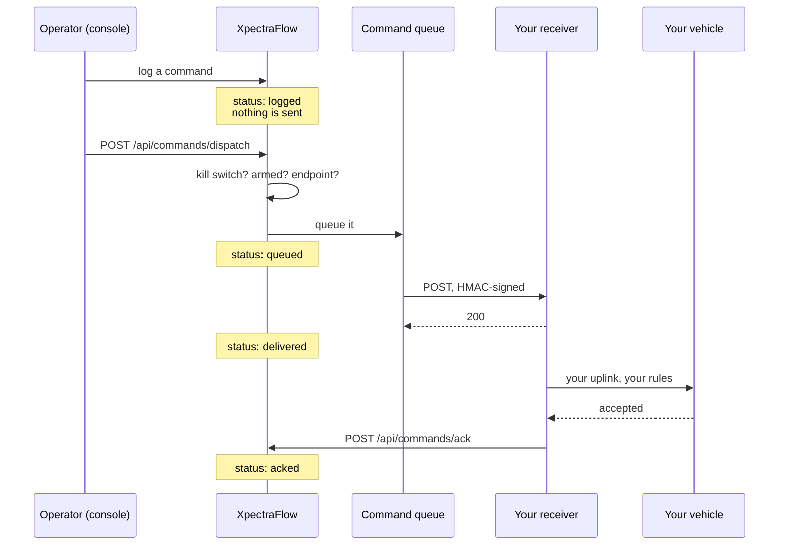

## Start with what we do not do

**XpectraFlow does not transmit to your vehicle.** Not over MAVLink, not over a
radio, not at all. The ingest path binds sockets it never writes to; there is no
command message on any telemetry subject, and a test asserts it stays that way.

That is a deliberate boundary, not an unfinished feature. The moment a system
can command a vehicle it inherits a regulatory surface, and we would rather not
stand between your operator and your aircraft.

So when an operator issues a command in the Command Center, this is what
happens: we **POST a signed notification to an HTTPS endpoint you registered**,
and your system decides what to do with it. You own the last mile. You keep the
interlocks, the radio, and the responsibility.

<Callout type="info">
If you do not register a webhook endpoint, the Command Center is a log. Commands
are recorded, annotated on the chart, and never sent anywhere. That is a
perfectly reasonable way to use it, and it is the default.
</Callout>

## The sequence

Note where the vehicle appears: only on your side of the diagram.

## The states

| State | Means |
|---|---|
| `logged` | Recorded. **Nothing has been sent.** |
| `queued` | Dispatched, waiting to go out |
| `delivered` | Your endpoint returned 2xx |
| `acked` | Your system reported the vehicle took it |
| `nacked` | Your system reported it was rejected |
| `timed_out` | Delivered, and then silence past the deadline |
| `failed` | Five delivery attempts, or your endpoint refused it |
| `retracted` | An operator withdrew it |

<Callout type="warn">
**`delivered` does not mean the vehicle heard anything.** It means your server
returned a 2xx. The word is not `transmitted`, deliberately — in eighteen months
somebody reading this database should not be able to conclude that we transmit.

`acked` is the state that means something reached a vehicle, and it is a state
only *you* can put a command into.
</Callout>

`timed_out` is the one worth watching. It means we handed the command over and
heard nothing back, so nobody knows whether the vehicle acted. That ambiguity is
exactly what an operator needs to see rather than have smoothed over.

## What you have to build

<Steps>
<Step>
### Register an endpoint

`POST /api/webhooks/create` gives you a signing secret, once. See
[the webhooks reference](/api/webhooks).
</Step>

<Step>
### Build a receiver

Verify the signature, respond 2xx quickly, and do the uplink asynchronously.
[The receiver guide](/commands/receiver) has working code in Python and Node.
</Step>

<Step>
### Arm the dataset

Nothing is delivered for a dataset that is not armed, and arming expires. See
[Arming](/commands/arming).
</Step>

<Step>
### Acknowledge

Tell us what the vehicle did, using the one-time token in the payload. Without
this every command ends at `timed_out`.
</Step>
</Steps>

## The three things that will surprise you

<Accordions>
  <Accordion title="A 4xx from your receiver is final — including a 400">
    A 5xx, a 429 or a timeout is retried five times. **Any other 4xx stops
    delivery immediately.**

    This matters because returning `400 Bad Request` on a transient internal
    error looks like careful error handling and is the single easiest way to
    lose a command. If you cannot process a delivery right now, return a 5xx.
  </Accordion>

  <Accordion title="Delivery is at-least-once, so deduplicate">
    A receiver that answers slowly may see the same command twice. Every payload
    carries `command.id` and `command.clientToken` — key your idempotency on one
    of them.

    We retry the *notification*, not the command. At-most-once on the wire to
    your vehicle is a safety property, and it is yours to enforce, because we
    are not on that wire.
  </Accordion>

  <Accordion title="Arming expires, and dispatch fails closed">
    Arming has a TTL of at most an hour. When it lapses, dispatch returns `409`
    and the command stays `logged` — nothing was attempted, and the audit row
    says so.

    This is deliberate friction. An interlock you can switch on and forget is
    one that is always on by the second week.
  </Accordion>
</Accordions>

## Next

<Cards>
  <Card title="Arming" href="/commands/arming" description="The interlock, its TTL, and the deployment-wide kill switch." />
  <Card title="Build a receiver" href="/commands/receiver" description="Signature verification in Python and Node, and how to respond." />
  <Card title="Lifecycle & retries" href="/commands/lifecycle" description="Every state, the retry schedule, and every way delivery fails." />
  <Card title="Commands API" href="/api/commands" description="dispatch, list, ack, arm, disarm." />
</Cards>
