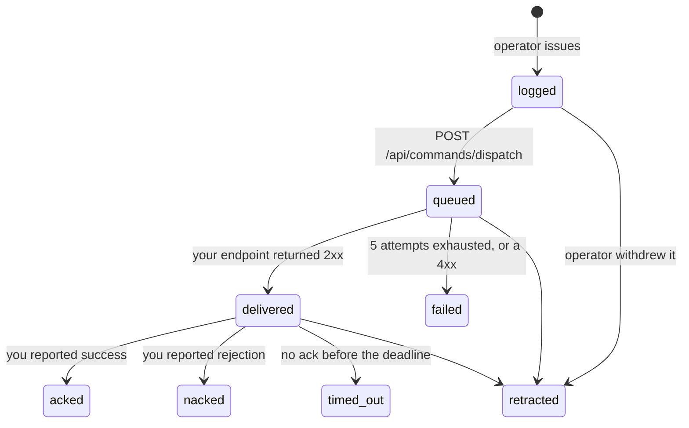

## The state machine



States only move forward. That is enforced by a database trigger, not only by
application code — the whole value of an audit trail is that it cannot be walked
backwards, and code is one refactor away from not enforcing something.

`retracted` is reachable from anywhere, because it records the operator's intent
rather than a claim about the wire, and an operator must always be able to take
a line off a chart.

## The retry schedule

Five attempts. This is a contract, not an implementation detail — size your
receiver's deduplication window against it.

| Attempt | When |
|---|---|
| 1 | immediately |
| 2 | +5 seconds |
| 3 | +25 seconds |
| 4 | +125 seconds |
| 5 | +625 seconds |

About thirteen minutes end to end. After the fifth the command becomes `failed`.

Fast enough that a receiver restarting picks the command up within seconds;
spread enough that a receiver down for ten minutes still gets it.

## What is retried, and what is not

| Your response | What happens |
|---|---|
| `2xx` | `delivered`. Done |
| `5xx` | Retried |
| `429` | Retried |
| timeout, connection refused, TLS failure | Retried |
| **any other `4xx`** | **`failed` immediately. No further attempts** |
| a `3xx` redirect | `failed`. Redirects are never followed |

<Callout type="warn">
**Returning `400` on a transient internal error will lose you commands.**

It reads as careful error handling — the request could not be processed, so
report a client error — and it is the single easiest way to drop a command
permanently. We treat a non-429 `4xx` as *"this endpoint has considered your
request and refused it"*, and retrying something that has been refused is not
resilience.

If you cannot process a delivery right now — your database is down, your queue
is full, a dependency is timing out — **return a 5xx.**
</Callout>

Redirects are refused rather than followed, because a `302` would move the
request to an address that never passed our checks on the URL you registered.

## Why we retry at all

A fair question, given that retrying a command to an aircraft is exactly the
wrong thing to do.

We are not retrying a command to an aircraft. We are retrying an HTTPS POST to a
server that did not answer, and those are different acts with different risks.
The last mile — where at-most-once genuinely is a safety property — is inside
your system, on a link we are not on.

Which is why the contract puts that responsibility somewhere it can be
discharged: delivery is **at-least-once**, every payload carries `command.id`
and `command.clientToken`, and
[your receiver deduplicates](/commands/receiver#deduplicate).

## Endpoint auto-disable

An endpoint whose last twenty delivery attempts all failed is disabled
automatically, and the organization's owners are notified.

An endpoint that has been 404ing for a week is a configuration error, and
continuing to retry it is how a retry loop becomes a denial-of-service against a
customer's own infrastructure.

Re-enabling is manual, on purpose. An endpoint that was disabled has been
observed broken twenty times running, and one successful delivery is not
evidence that whatever was wrong has been fixed.

## Diagnosing a command that never arrived

<Steps>
<Step>
### Check its status

```bash
curl -s "https://app.xpectraflow.com/api/commands/list?experimentId=$EXPERIMENT_ID&datasetId=$DATASET_ID" \
  -H "x-api-key: $XPECTRA_API_KEY"
```

`logged` means nobody dispatched it, or a dispatch was refused. That is by far
the most common answer, and an unarmed dataset is by far the most common reason.
</Step>

<Step>
### Check the attempts

```bash
curl -s "https://app.xpectraflow.com/api/webhooks/deliveries?commandId=$COMMAND_ID" \
  -H "x-api-key: $XPECTRA_API_KEY"
```

One row per attempt, newest first, with the status code and error from each.
</Step>

<Step>
### Read the shape

| What you see | What it means |
|---|---|
| No rows at all | Never dispatched. Back to step 1 |
| Five rows, all 5xx | We reached you and you errored every time |
| One row, a 4xx | You refused it and we stopped. Was that deliberate? |
| One row, a TLS or DNS error | We could not reach you. Check the URL and certificate |
| Rows, then `timed_out` | Delivered fine — you never acknowledged |
</Step>
</Steps>

## Timeouts

`ackTimeoutSeconds` on dispatch, 30 to 3600, defaulting to 300.

Stored as an absolute instant when the command is dispatched, so changing the
default later never re-times commands already in flight.

A command that reaches its deadline without an acknowledgement becomes
`timed_out` and the issuing operator is notified. That state is not a failure of
delivery — the delivery worked — it is a statement that nobody knows what the
vehicle did, which is precisely the thing worth surfacing rather than hiding.
